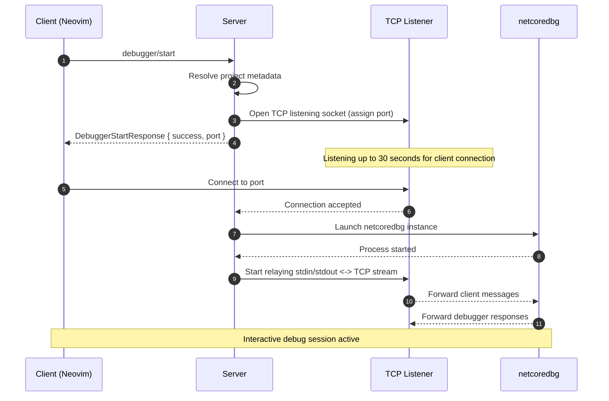

# Debugging Integration Flows

*(JSON-RPC Server ↔ Client (Neovim / easy-dotnet.nvim))*

This document describes how the debugging subsystem works inside the server.
The Neovim plugin acts as a **client** and interacts with the server via **JSON-RPC** endpoints.

There are **two debugging flows**:

1. **Client-initiated**:
   The client requests the server to prepare/start a debugger instance and returns a TCP port.

2. **Server-initiated**:
   The server instructs the client to establish a debug session and return a `sessionId`.

Both flows ultimately result in the debugger listening on a TCP socket which the client connects to (typically via nvim-dap).

# 1. Client-Initiated Debugging Session

In this flow, the client directly calls the server’s debugger/start endpoint.
The server resolves project metadata and prepares a TCP listening socket for an upcoming debugger connection.
Once the client connects to this socket, the server launches netcoredbg and binds it to the established connection.

## Endpoint

### `debugger/start`

| Parameter | Type                   | Optional |
| --------- | ---------------------- | -------- |
| `request` | `DebuggerStartRequest` | No       |

### `DebuggerStartRequest`

```csharp
public sealed record DebuggerStartRequest(
  string TargetPath,
  string? TargetFramework,
  string? Configuration,
  string? LaunchProfileName
);
```

### Response: `DebuggerStartResponse`

```csharp
public sealed record DebuggerStartResponse(
  bool Success,
  int Port
);
```

If `Success == true`, the server has successfully allocated a TCP port and is listening for a client connection.

## Socket Lifecycle & netcoredbg Startup Behavior

### When the server returns a port:
- A server-side TCP socket is already open and listening.
- This socket remains open for up to 30 seconds.
- The client is expected to connect within this window.
- Only after the client connects does the server:
    1. Launch a new netcoredbg instance
    2. Relay messages both ways between netcoredbg `stdin/stdout` and the TCP stream

### If the client fails to connect within 30 seconds:
- The listening socket is closed.
- Any associated state is cleaned up.
- No netcoredbg instance is started.

This design ensures that netcoredbg is only launched when a client is actually ready to use it, avoiding orphaned debugger processes.

## Sequence Diagram (Client-Initiated)



# 2. Server-Initiated Debugging Session

*(JSON-RPC: `startDebugSession`)*

In this flow, the server already has a debugger socket ready (or has orchestrated a debugging backend in some other way) and now instructs the client to begin a debug adapter session by connecting to a specified `host` and `port`.

- The client is responsible for:
- Establishing the TCP connection to `host:port`
- Initializing the debug adapter (typically nvim-dap)
- Returning a client-generated sessionId
- Managing the lifecycle of the debug session identified by that sessionId

The sessionId is used by the server as a simple handle to reference this active debug session for later control operations such as termination.

## JSON-RPC Method (Server → Client)

### Request

**Method:** `startDebugSession`
j
**Direction:** Server → Client

**JSON-RPC 2.0 Message:**

```json
{
  "jsonrpc": "2.0",
  "id": 42,
  "method": "startDebugSession",
  "params": {
    "host": "127.0.0.1",
    "port": 4711
  }
}
```

### Successful Response (Client → Server)

```json
{
  "jsonrpc": "2.0",
  "id": 42,
  "result": {
    "sessionId": 3
  }
}
```

The `sessionId` is **generated by the client** and **unique per active debugging session**.
The server stores this ID and uses it whenever it needs to control the session (e.g., terminate it).


## Debug Session Termination

To request the client to terminate a previously started session, the server uses the `terminateDebugSession` JSON-RPC method.

### Request (Server → Client)

```json
{
  "jsonrpc": "2.0",
  "id": 43,
  "method": "terminateDebugSession",
  "params": {
    "sessionId": 3
  }
}
```

### Response (Client → Server)

```json
{
  "jsonrpc": "2.0",
  "id": 43,
  "result": true
}
```

A result of `true` indicates the client has successfully terminated the session identified by `sessionId`.


## Summary

* `startDebugSession` tells the client to begin a debug session and return a `sessionId`.
* `sessionId` is a **client-side identifier** that the server uses to refer to that session.
* The server can later call `terminateDebugSession` using the same `sessionId`.
* This pattern allows the server to manage multiple concurrent or sequential debugging sessions without storing editor-specific state.

# 3. Responsibilities Summary

## Server

* Hosts the `debugger/start` endpoint.
* Resolves project metadata and opens a **listening TCP socket** for the debugger connection.
* Waits up to **30 seconds** for the client to connect before cleaning up the socket.
* Launches `netcoredbg` **only after** the client connects to the listening socket, then relays messages between the TCP stream and the debugger process.
* Initiates client-side debugging via the `startDebugSession` JSON-RPC method when needed.
* Tracks active sessions using **client-provided `sessionId`** values.
* Requests session termination via the `terminateDebugSession` JSON-RPC method.

## Client (Neovim Plugin)

* Calls `debugger/start` to request a new debugging socket from the server.
* Connects to the returned TCP port (typically via nvim-dap) and begins the debug adapter protocol.
* Implements the JSON-RPC `startDebugSession` method, creating a new debug session and returning a **client-generated `sessionId`**.
* Implements `terminateDebugSession`, allowing the server to request clean shutdown of a specific debug session.
* Handles all editor integration and UI feedback

